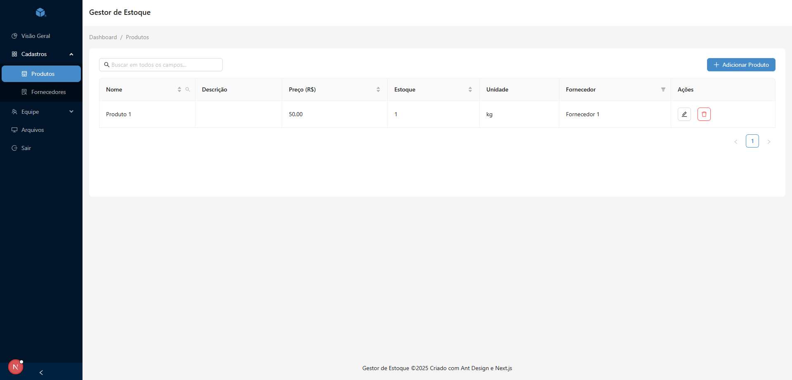

# Projeto-Estoque

Trabalho da disciplina Análise e Projeto de Sistemas (APS) do curso Ciências da Computação 7º semestre do IFCE Maracanaú.

## Getting Started

Primeiro, execute o servidor de desenvolvimento:

```bash
npm run dev
# ou
yarn dev
# ou
pnpm dev
# ou
bun dev
```

Abra [http://localhost:3000](http://localhost:3000) no seu navegador para ver o resultado.

Você pode começar a editar a página modificando o arquivo `app/auth/login/page.tsx`. A página será atualizada automaticamente conforme você edita o arquivo.



